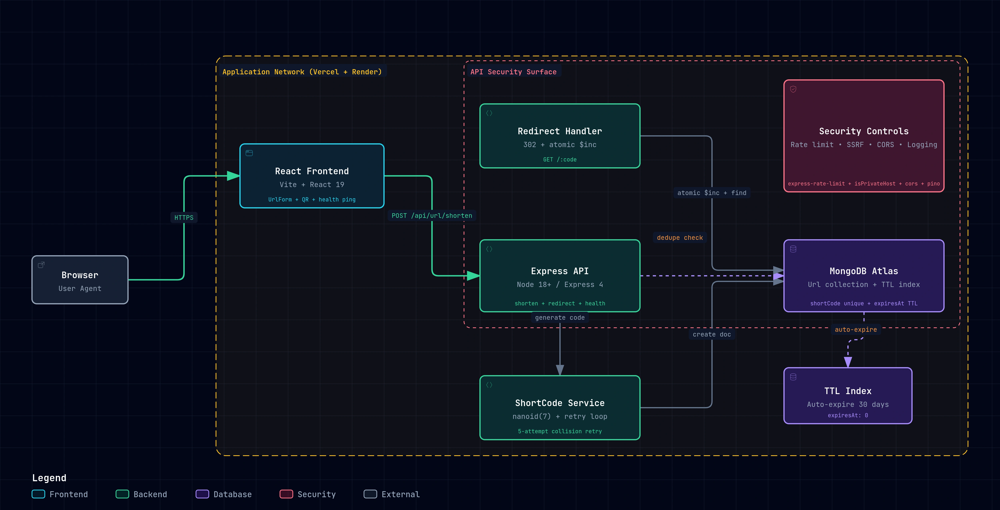

# LinkShrink 
 A full-stack URL shortening service built with the MERN stack. Allowing users to convert the long URLs into shortened, easy-to-share links

## Features
- **Instant Shortening**: Converts any valid Http/Https link.
- **Smart Redirection**: Fast `302` redirects to original sources.
- **Click Tracking**: Persistent counter for every visit.
- **Copy-to-clipboard**: For quick sharing.
- **Responsive Design** : Mobile compatible UI.
- **Title** : custom title for URLs
- **QR Code** : QR code generate for each URL

## System Architecture



The application checks for existing URLs, generates a unique key using a non-sequential robust algorithm (`nanoid`), validates the input against SSRF vectors, and stores the mapping in a high-availability MongoDB cluster.

### Request Flow
1. **Creation (`POST /api/url/shorten`):**
   - User submits long URL and optional title via `UrlForm`.
   - Express API verifies protocol (`http:`, `https:`) and validates against SSRF guard (blocking private IPs, loopback, and cloud metadata).
   - Rate limiter applies IP throttle (100 req / 15 min).
   - Lookup checks for existing `longUrl` to deduplicate.
   - If new, `ShortCode Service` generates 7-character `nanoid`. A 5-attempt retry loop catches Mongo duplicate key error `11000`.
   - Document saved to MongoDB Atlas with a 30-day TTL expiration index.
2. **Redirection (`GET /:code`):**
   - User accesses short link.
   - Handler runs atomic `findOneAndUpdate` matching `shortCode`.
   - Click counter increments via `$inc: { clicks: 1 }` without concurrency race conditions.
   - Server returns HTTP `302 Found` redirecting to the destination.

### Key Engineering Decisions
- **Collision Resistance:** 7-character Base62 `nanoid` (~4.4 trillion space) with 5-attempt retry loop on Mongo duplicate key (`11000`) instead of sequential IDs.
- **Atomic Click Tracking:** Uses MongoDB `$inc` in `findOneAndUpdate` to prevent lost updates under concurrent traffic.
- **Automated Lifecycle (TTL Index):** Offloads link expiration to MongoDB background TTL thread (`expiresAt: 0`, 30 days) without cron jobs.
- **Scoped Rate Limiting:** Enforces `express-rate-limit` strictly on creation (`POST /api/url/shorten`), keeping redirects unthrottled.
- **HTTP `302` vs `301` Semantics:** Uses `302 Found` (temporary redirect) so browsers re-query LinkShrink on every click, guaranteeing accurate analytics.

---

## API Specifications

| Endpoint | Method | Request Payload / Params | Status Codes | Description |
|---|---|---|---|---|
| `/api/url/shorten` | `POST` | `{"longUrl": "https://...", "title": "Optional"}` | `201 Created`<br>`200 OK` (deduped)<br>`400 Bad Request`<br>`429 Too Many Requests` | Validates, sanitizes, and creates shortened URL |
| `/:code` | `GET` | `:code` (7-character shortCode) | `302 Found`<br>`404 Not Found`<br>`500 Server Error` | Atomically increments clicks and redirects to destination |

---

## Tech Stack
**Frontend:** React + vite, CSS.  
**Backend:** Node.js, Express.  
**Database:** MongoDB.  

---

## Getting Started

### Prerequisites & Environment
- Node.js (v18+), MongoDB Atlas or local MongoDB
- Backend `.env`: `PORT=5000`, `MONGO_URI=<mongodb_uri>`, `BASE_URL=http://localhost:5000`

### Setup & Run
```bash
# 1. Backend
cd backend && npm install && npm start

# 2. Frontend
cd frontend && npm install && npm run dev
```

### Automated Tests
```bash
cd backend && npm test
```

---

## Future improvements(Ideas)
1. **Caching Layer (Redis)**: cache popular redirects to reduce DB hits.
2. **Load Balancing**: Distribute traffic across multiple Node instances.
3. **Authentication**: Add Authentication.
